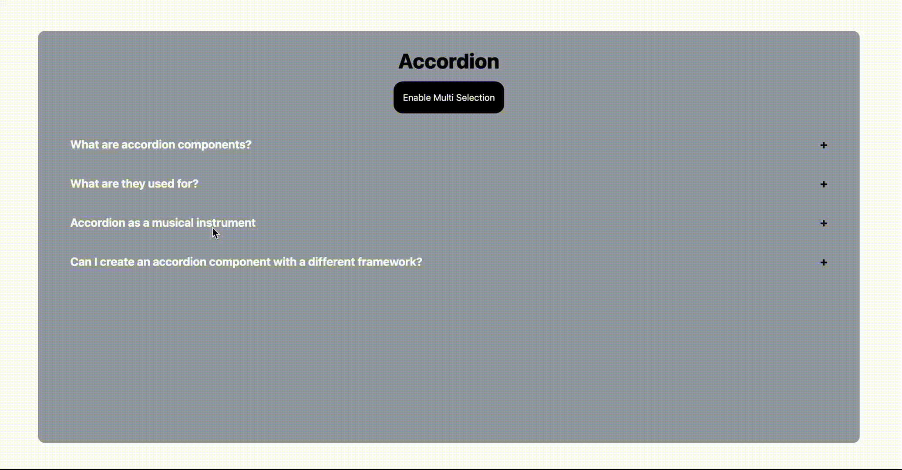

# Accordion

This is a simple and reusable Accordion component built using React. The Accordion component allows you to display content in a collapsible and expandable format, making it perfect for FAQs, sections of text, or any other content that you want to toggle visibility.

## Features

- **Single Selection**: Allows only one accordion item to be expanded at a time. When a new item is opened, the previously opened item will automatically close.
- **Multi-Selection**: Allows multiple accordion items to be expanded simultaneously. Users can expand or collapse items independently without affecting others.
- **Customizable**: Style the Accordion to match your application's theme using custom CSS or inline styles.


## Demo



## Installation

1. Clone the repository:

   ```bash
   git clone https://github.com/yourusername/accordion.git
